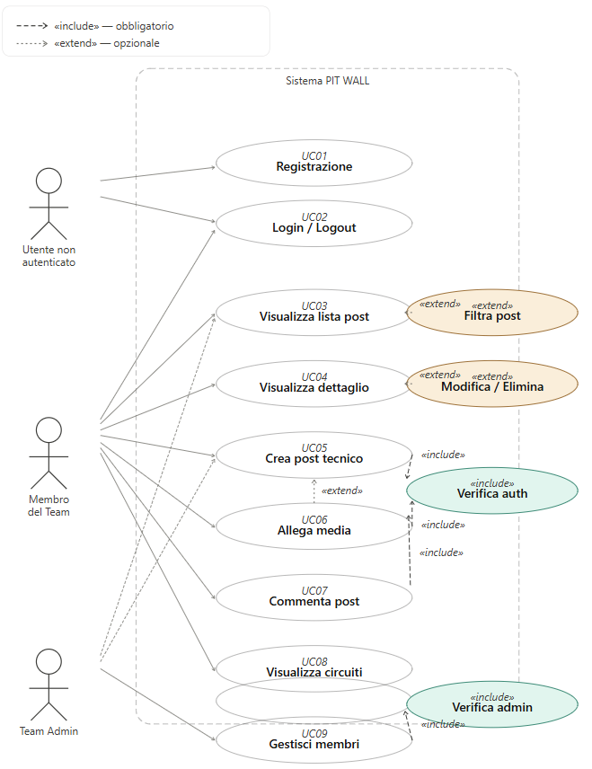
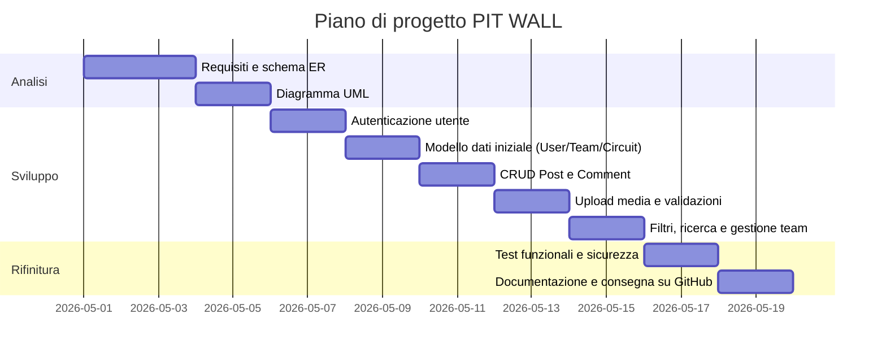

# PIT WALL
**Formula 1 Team Data Platform**

`Backend: Python / Flask` `Database: SQL` `Frontend: HTML / CSS / JS`

---

## Indice

1. [Introduzione](#1-introduzione)
   - 1.1 [Scopo del documento](#11-scopo-del-documento)
   - 1.2 [Contesto](#12-contesto)
   - 1.3 [Tema scelto](#13-tema-scelto-pit-wall)
2. [Obiettivi Generali](#2-obiettivi-generali)
3. [Stakeholder e Attori](#3-stakeholder-e-attori)
4. [Requisiti Funzionali](#4-requisiti-funzionali)
   - 4.1 [Requisiti Principali](#41-requisiti-principali)
   - 4.2 [User Stories](#42-user-stories)
5. [Requisiti Non Funzionali](#5-requisiti-non-funzionali)
6. [Casi d'Uso](#6-casi-duso)
   - 6.1 [Casi d'Uso Essenziali](#61-casi-duso-essenziali)
   - 6.2 [Descrizione Semplificata dei Casi d'Uso](#62-descrizione-semplificata-dei-casi-duso)
   - 6.3 [Relazioni tra Casi d'Uso: include ed extend](#63-relazioni-tra-casi-duso-include-ed-extend)
   - 6.4 [Tabella Riepilogativa dei Casi d'Uso](#64-tabella-riepilogativa-dei-casi-duso)
7. [Glossario dei Termini](#7-glossario-dei-termini)
8. [Pianificazione e Milestone](#8-pianificazione-e-milestone)
   - 8.1 [Fasi del Progetto](#81-fasi-del-progetto)
   - 8.2 [Gantt Semplificato](#82-gantt-semplificato)

---

## 1. Introduzione

### 1.1 Scopo del documento

Lo scopo di questo documento è:

- Descrivere in modo chiaro il prodotto realizzato.
- Raccogliere i requisiti funzionali e non funzionali.
- Fornire una prima progettazione concettuale con diagrammi ER, UML e casi d'uso.
- Definire una roadmap di lavoro con milestone e attività principali, organizzata nelle fasi di analisi, sviluppo e rifinitura.

### 1.2 Contesto

L'applicazione è un'applicazione web con backend in Python/Flask e database relazionale. Il tema soddisfa i seguenti criteri progettuali:

- Gestione dati persistente tra sessioni.
- Autenticazione e sicurezza degli accessi.
- Interfaccia web con visualizzazione dinamica.
- Relazioni tra più tabelle nel database.

### 1.3 Tema scelto: PIT WALL

PIT WALL è una piattaforma digitale dedicata ai team di Formula 1. Ogni team dispone di uno spazio privato in cui i propri membri possono pubblicare e condividere dati tecnici (telemetrie, strategie, setup vettura), post, media e commenti relativi a ogni circuito del calendario di gara.

La piattaforma include anche una sezione con le caratteristiche tecniche di ciascun circuito del Mondiale di Formula 1, consultabile da tutti gli utenti autenticati indipendentemente dal team di appartenenza.

Il nome *PIT WALL* richiama la zona dei box in Formula 1, dove si trovano ingegneri e tecnici che analizzano i dati della vettura in tempo reale.

---

## 2. Obiettivi Generali

1. Permettere a un utente di registrarsi e autenticarsi tramite codice invito del proprio team.
2. Consentire la creazione, modifica, eliminazione e visualizzazione di post tecnici (telemetria, strategia, setup, analisi) associati a un circuito.
3. Garantire che i contenuti di ogni team siano visibili esclusivamente ai propri membri.
4. Consentire il caricamento di file media allegati ai post (immagini, PDF, CSV di telemetria).
5. Permettere ai membri del team di commentare i post pubblicati.
6. Fornire una sezione circuiti con le caratteristiche tecniche di ogni tracciato del calendario F1.
7. Offrire una pagina di profilo dove l'utente vede le proprie attività, post pubblicati e statistiche.

---

## 3. Stakeholder e Attori

| Stakeholder | Ruolo | Interesse |
|---|---|---|
| Autore del progetto | Sviluppatore | Progettare e realizzare l'applicazione |
| Membro del Team F1 | Utente finale | Caricare e consultare dati tecnici del proprio team |
| Team Admin | Gestore del team | Gestire i membri e i contenuti del proprio spazio |

### Attori Principali

- **Utente Non Autenticato** — può accedere solo alla pagina di login e registrazione.
- **Membro del Team** — utente autenticato appartenente a un team; può creare post, caricare media, commentare e consultare i circuiti.
- **Team Admin** — membro con privilegi elevati; può gestire i membri del team e modificare o eliminare qualsiasi contenuto del team.
- **Sistema** — attore interno che gestisce sessioni, validazione upload e controlli di sicurezza sulle route.

---

## 4. Requisiti Funzionali

### 4.1 Requisiti Principali

1. Registrazione e login con codice invito del team.
2. Creazione di un post tecnico con titolo, corpo, categoria (telemetria / strategia / setup / analisi), circuito associato e data.
3. Visualizzazione dei post del proprio team filtrabili per circuito, categoria o data.
4. Modifica ed eliminazione dei post da parte dell'autore o dell'admin.
5. Caricamento di file media allegati a un post (PNG, JPG, PDF, CSV); download protetto per i soli membri del team.
6. Pubblicazione e visualizzazione di commenti sui post del team.
7. Sezione circuiti con informazioni tecniche di ogni tracciato (nome, paese, lunghezza, curve, record sul giro, layout).
8. Pagina di profilo con riepilogo dei propri post, commenti e media caricati.
9. Gestione del team da parte dell'admin: invito nuovi membri tramite codice, rimozione, promozione a co-admin.

### 4.2 User Stories

- Come **membro del team**, voglio registrarmi con il codice invito affinché le mie attività siano collegate al team corretto.
- Come **membro**, voglio creare un post tecnico su un circuito specifico per condividere dati con i colleghi.
- Come **membro**, voglio filtrare i post per circuito o categoria in modo da trovare rapidamente le informazioni che mi servono.
- Come **membro**, voglio allegare file CSV di telemetria o grafici PDF ai post per rendere l'analisi più completa.
- Come **membro**, voglio commentare i post del team per discutere strategie e dati in tempo reale.
- Come **utente autenticato**, voglio consultare la scheda di un circuito per conoscerne le caratteristiche tecniche.
- Come **Team Admin**, voglio invitare nuovi tecnici nel team tramite codice in modo da controllare chi accede ai dati.

---

## 5. Requisiti Non Funzionali

- L'applicazione deve avere un'interfaccia semplice, chiara e responsive (desktop e tablet).
- Il login deve essere protetto con hashing delle password.
- Tutte le route che accedono a dati del team devono verificare che l'utente autenticato appartenga al team corretto (controllo `team_id`).
- Il backend deve usare un database SQL.
- Il codice deve essere organizzato con **Flask Blueprint**, un Blueprint per ogni area funzionale.
- I file caricati devono avere una whitelist di estensioni consentite (`png`, `jpg`, `pdf`, `csv`) e una dimensione massima di **10 MB**.
- I file caricati non devono essere accessibili tramite URL diretto, ma solo tramite route Flask autenticata.
- Deve essere possibile eseguire il progetto localmente con un ambiente virtuale Python e file `.env` per le variabili sensibili.
- I dati devono essere persistenti tra una sessione e l'altra.
- Le pagine devono caricarsi in meno di **2 secondi** in ambiente locale.

---

## 6. Casi d'Uso

### 6.1 Casi d'Uso Essenziali

Il diagramma dei casi d'uso (UC) descrive le interazioni principali tra gli attori del sistema e le funzionalità della piattaforma.

### 6.2 Descrizione Semplificata dei Casi d'Uso

#### UC01 – Registrazione

Il visitatore inserisce username, email, password e codice invito del team. Il sistema verifica il codice, crea l'account e associa l'utente al team corrispondente, aprendo la sessione.

#### UC02 – Login / Logout

L'utente inserisce email e password. Il sistema verifica le credenziali, apre la sessione e reindirizza alla dashboard del team. Al logout, la sessione viene invalidata.

#### UC03/04 – Visualizza Post + Visualizza dettaglio

Il membro autenticato visualizza la lista dei post del proprio team, opzionalmente filtrati per circuito, categoria o data. Selezionando un post accede al dettaglio con corpo, media allegati e commenti.

#### UC05 – Crea Post Tecnico

Il membro autenticato compila un form con titolo, corpo, categoria e circuito associato. Il sistema salva il post collegandolo al team e all'autore.

#### UC06 – Commenta Post

Il membro visualizza un post e inserisce un commento. Il sistema salva il commento con timestamp e lo mostra in ordine cronologico sotto il post.

#### UC07 – Gestisci Membri (Admin)

Il Team Admin accede alla pagina di gestione del team, dove può generare o rigenerare il codice invito, rimuovere un membro o promuoverlo a co-admin.

#### UC08 – Visualizza Circuiti

Qualsiasi utente autenticato può accedere alla sezione circuiti, visualizzare la lista e aprire la scheda tecnica di ogni tracciato (lunghezza, curve, layout, record sul giro).

### 6.3 Relazioni tra Casi d'Uso: include ed extend

In un diagramma dei casi d'uso si usano due tipi di relazioni aggiuntive:

- `<<include>>` — rappresenta un comportamento **obbligatorio** riutilizzabile. Un caso d'uso base include un altro quando il suo comportamento è sempre eseguito.
- `<<extend>>` — rappresenta un comportamento **opzionale** o alternativo che si aggiunge al caso d'uso base solo in certe condizioni.

I casi d'uso che richiedono autenticazione includono obbligatoriamente la verifica della sessione:

- Crea Post `<<include>>` Verifica Autenticazione
- Allega Media `<<include>>` Verifica Autenticazione
- Commenta Post `<<include>>` Verifica Autenticazione
- Gestisci Membri `<<include>>` Verifica Ruolo Admin

Esempi di extend (comportamenti opzionali):

- Allega Media `<<extend>>` Crea Post — allegare file è un'azione opzionale durante la creazione di un post.
- Filtra Post `<<extend>>` Visualizza Lista Post — il filtro per circuito o categoria è attivabile opzionalmente.
- Modifica/Elimina Post `<<extend>>` Visualizza Dettaglio Post — disponibile solo per l'autore o l'admin.

### 6.4 Tabella Riepilogativa dei Casi d'Uso

| ID | Caso d'Uso | Attore | Relazioni |
|---|---|---|---|
| UC01 | Registrazione con codice invito | Utente non auth. | — |
| UC02 | Login / Logout | Tutti gli attori | — |
| UC03 | Visualizza lista post | Membro / Admin | `<<extend>>` Filtra Post |
| UC04 | Visualizza dettaglio post | Membro / Admin | `<<extend>>` Modifica/Elimina |
| UC05 | Crea post tecnico | Membro / Admin | `<<include>>` Verifica Auth |
| UC06 | Allega media | Membro / Admin | `<<include>>` Verifica Auth; `<<extend>>` Crea Post |
| UC07 | Commenta post | Membro / Admin | `<<include>>` Verifica Auth |
| UC08 | Visualizza circuiti | Membro / Admin | — |
| UC09 | Gestisci membri team | Admin | `<<include>>` Verifica Ruolo Admin |

---

## 7. Glossario dei Termini

| Termine | Definizione |
|---|---|
| Post tecnico | Contenuto creato da un membro del team, composto da titolo, corpo, categoria e riferimento a un circuito. |
| Categoria | Raggruppamento tematico del post: telemetria, strategia, setup vettura o analisi. |
| Telemetria | Dati tecnici registrati dalla vettura durante le sessioni (velocità, carichi aerodinamici, temperature, ecc.). |
| Strategia | Piano di gara del team: soste ai box, scelta gomme, modalità di guida. |
| Setup vettura | Configurazione meccanica e aerodinamica della monoposto per un determinato circuito. |
| Media | File allegato a un post: immagine (PNG/JPG), grafico (PDF) o file di telemetria (CSV). |
| Circuito | Tracciato del calendario F1 con attributi tecnici: nome, paese, lunghezza, numero di curve, record sul giro. |
| Team | Gruppo di utenti (es. un team F1) che condivide uno spazio privato sulla piattaforma. |
| Codice invito | Stringa univoca generata dal Team Admin che consente a nuovi utenti di registrarsi e accedere al team. |
| Team Admin | Utente con privilegi di gestione del team: può invitare, rimuovere e promuovere membri. |
| Pit Wall | Zona dei box da cui ingegneri e tecnici monitorano la gara; nome simbolico del progetto. |
| Membro | Utente autenticato appartenente a un team, con ruolo `member`. |

---

## 8. Pianificazione e milestone

Questa sezione descrive la sequenza di lavoro del progetto, suddivisa in tre fasi principali:

- Analisi: definire i requisiti, i casi d'uso e i modelli concettuali.
- Sviluppo: realizzare le funzionalità principali, l'interfaccia e la gestione dati.
- Rifinitura: testare, correggere e preparare la consegna.

Nella fase di analisi si producono gli schemi ER e UML; questi documenti aiutano a progettare il database e le classi prima di scrivere il codice.

Un possibile piano di lavoro su 5 settimane (adattato al progetto PIT WALL):

| Settimana | Attività |
| --- | --- |
| 1 | Analisi dei requisiti, scelta del tema, disegno ER e UML, preparazione ambiente di lavoro (virtualenv, .env, struttura Blueprint) |
| 2 | Configurazione Flask, sistema di autenticazione (registrazione con codice invito, login, hashing), modello dati iniziale (User, Team, Circuit) |
| 3 | Implementazione CRUD per Post e Comment, associazione Post-Team-Circuit, validazione upload media |
| 4 | Filtri e ricerca (per circuito, categoria, data), gestione team (inviti, promozioni), profilo utente e pagine di elenco/dettaglio |
| 5 | Test funzionali, controlli di sicurezza (accesso ai media, controllo team_id), ottimizzazioni, documentazione e preparazione consegna su GitHub |

### 8.1 Gantt semplificato

