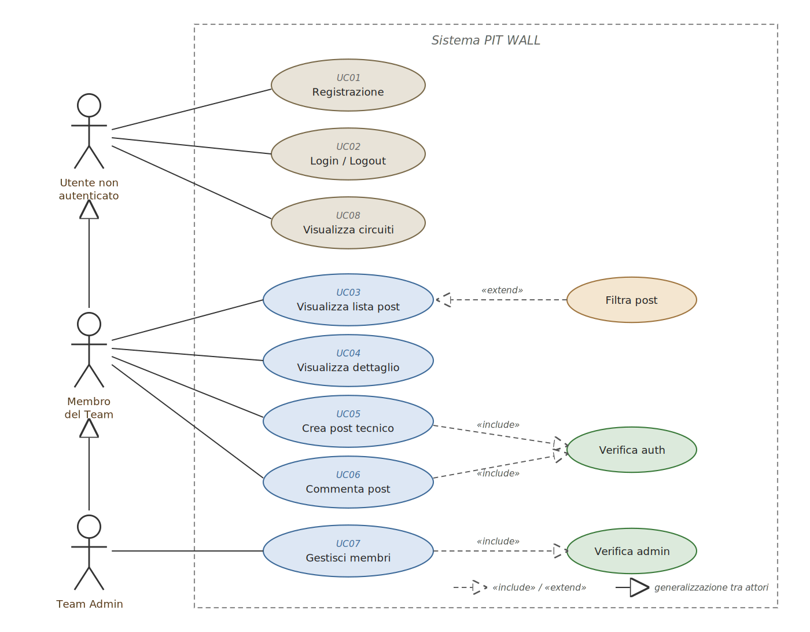
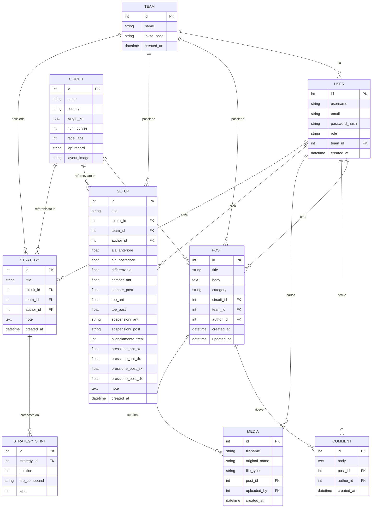
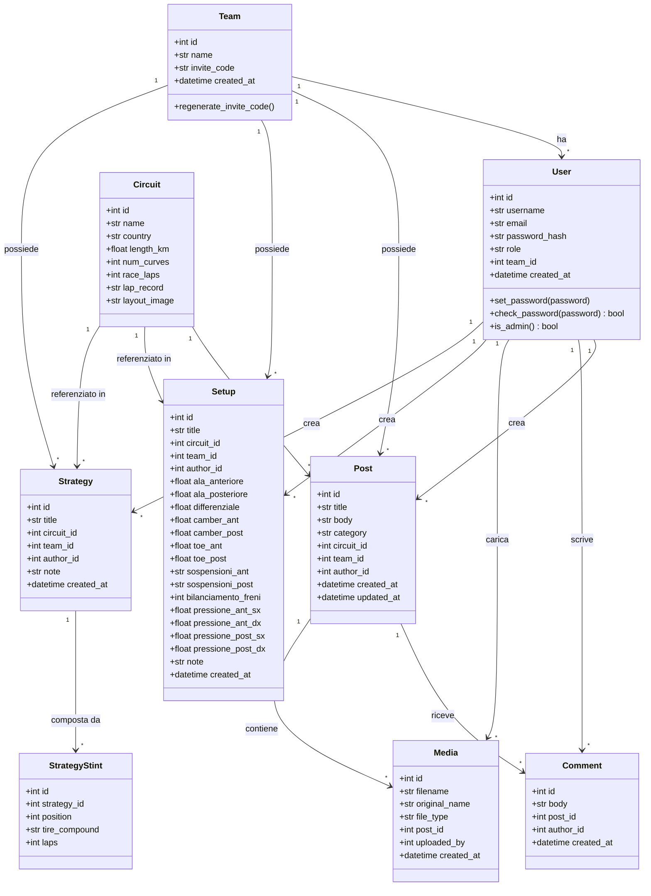
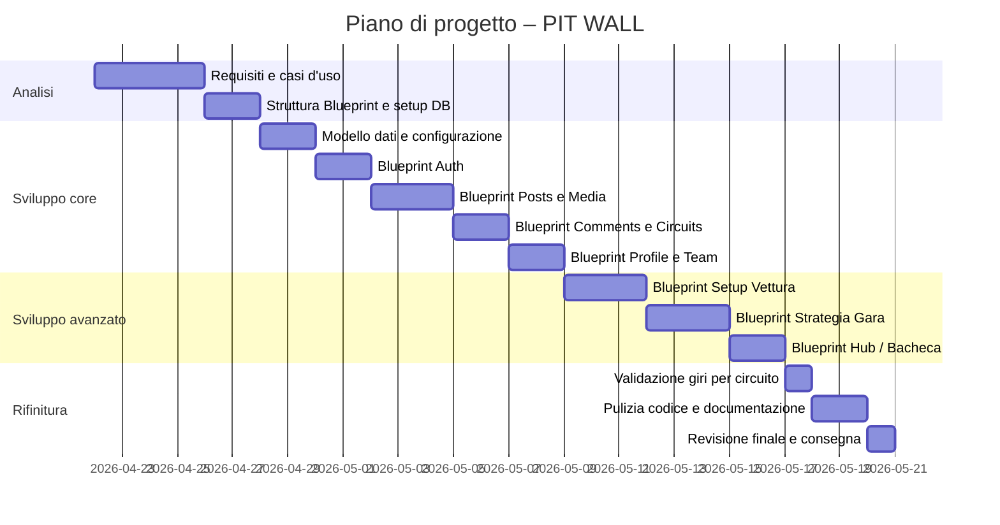

# PIT WALL
**Formula 1 Team Data Platform**

`Backend: Python / Flask` `Database: SQLite / SQLAlchemy` `Frontend: HTML / CSS / JS`

---

## Indice

1. [Introduzione](#1-introduzione)
   - 1.1 [Scopo del documento](#11-scopo-del-documento)
   - 1.2 [Contesto](#12-contesto)
   - 1.3 [Tema scelto](#13-tema-scelto-pit-wall)
2. [Obiettivi Generali](#2-obiettivi-generali)
3. [Stakeholder e Attori](#3-stakeholder-e-attori)
4. [Requisiti Funzionali](#4-requisiti-funzionali)
   - 4.1 [Requisiti Principali](#41-requisiti-principali)
   - 4.2 [User Stories](#42-user-stories)
5. [Requisiti Non Funzionali](#5-requisiti-non-funzionali)
6. [Casi d'Uso](#6-casi-duso)
   - 6.1 [Diagramma dei Casi d'Uso](#61-diagramma-dei-casi-duso)
   - 6.2 [Descrizione Semplificata dei Casi d'Uso](#62-descrizione-semplificata-dei-casi-duso)
   - 6.3 [Relazioni include ed extend](#63-relazioni-tra-casi-duso-include-ed-extend)
   - 6.4 [Tabella Riepilogativa](#64-tabella-riepilogativa-dei-casi-duso)
7. [Entità e Relazioni (Schema ER)](#7-entità-e-relazioni-schema-er)
8. [Diagramma UML delle Classi](#8-diagramma-uml-delle-classi)
9. [Glossario dei Termini](#9-glossario-dei-termini)
10. [Gantt](#10-gantt)

---

## 1. Introduzione

### 1.1 Scopo del documento

Lo scopo di questo documento è:

- Descrivere in modo chiaro il prodotto realizzato.
- Raccogliere i requisiti funzionali e non funzionali.
- Fornire una progettazione concettuale con diagrammi ER, UML e casi d'uso.
- Definire una roadmap di lavoro con milestone e attività principali.

### 1.2 Contesto

L'applicazione è un'applicazione web con backend in Python/Flask e database relazionale SQLite. Il tema soddisfa i seguenti criteri progettuali:

- Gestione dati persistente tra sessioni.
- Autenticazione e sicurezza degli accessi.
- Interfaccia web con visualizzazione dinamica.
- Relazioni tra più tabelle nel database.
- Generazione di grafici server-side (matplotlib).

### 1.3 Tema scelto: PIT WALL

PIT WALL è una piattaforma digitale dedicata ai team di Formula 1. Ogni team dispone di uno spazio privato in cui i propri membri possono gestire setup vettura, strategie di gara, dati di telemetria e analisi tecniche relative a ogni circuito del calendario di gara.

La piattaforma include anche una sezione pubblica con le caratteristiche tecniche di ciascun circuito (compresi i giri di gara ufficiali), consultabile da qualsiasi visitatore senza autenticazione.

Il nome *PIT WALL* richiama la zona dei box in Formula 1, dove si trovano ingegneri e tecnici che analizzano i dati della vettura in tempo reale.

---

## 2. Obiettivi Generali

1. Permettere a un utente di registrarsi e autenticarsi tramite codice invito del proprio team.
2. Fornire una bacheca (Hub) che raccoglie in un'unica vista tutti i contenuti del team.
3. Consentire la creazione, modifica e cancellazione di analisi tecniche associate a un circuito.
4. Permettere la gestione completa del **setup vettura** (aerodinamica, sospensioni, differenziale, freni, pressioni gomme).
5. Permettere la pianificazione di **strategie di gara** con validazione del numero di giri per circuito.
6. Garantire che i contenuti di ogni team siano visibili esclusivamente ai propri membri.
8. Fornire una sezione circuiti pubblica con dati tecnici di ogni tracciato del calendario F1.
9. Offrire una pagina di profilo con riepilogo delle attività dell'utente.

---

## 3. Stakeholder e Attori

| Stakeholder | Ruolo | Interesse |
|---|---|---|
| Autore del progetto | Sviluppatore | Progettare e realizzare l'applicazione |
| Membro del Team F1 | Utente finale | Caricare e consultare dati tecnici del proprio team |
| Team Admin | Gestore del team | Gestire i membri e i contenuti del proprio spazio |

### Attori Principali

- **Utente Non Autenticato** — visitatore della piattaforma; può accedere alle pagine di login e registrazione e consultare la sezione pubblica dei circuiti.
- **Membro del Team** — utente autenticato appartenente a un team; può creare post, setup, strategie, caricare telemetrie, commentare e consultare i circuiti.
- **Team Admin** — membro con privilegi elevati; può gestire i membri del team e modificare o eliminare qualsiasi contenuto del team.
- **Sistema** — attore interno che gestisce sessioni, validazione upload, controlli di sicurezza sulle route e generazione dei grafici.

---

## 4. Requisiti Funzionali

### 4.1 Requisiti Principali

1. Registrazione e login con codice invito del team; il primo iscritto diventa automaticamente admin.
2. Bacheca (Hub) con accesso rapido a tutti i contenuti del team filtrabili per circuito.
3. Creazione di un post di analisi con titolo, corpo, circuito associato e allegati opzionali (PNG, JPG, PDF, CSV).
4. Visualizzazione dei post filtrabili per circuito e categoria.
5. Modifica ed eliminazione dei post da parte dell'autore o dell'admin.
6. Commenti ai post del team in ordine cronologico.
7. Gestione del **setup vettura** con i seguenti parametri:
   - Aerodinamica: ala anteriore e posteriore (mm)
   - Differenziale: bloccaggio uscita curva (%)
   - Geometria sospensioni: campanatura (ant/post), divergenza anteriore, convergenza posteriore
   - Sospensioni: rigidità anteriore e posteriore (click 1–12)
   - Freni: bilanciamento anteriore (%)
   - Pressioni pneumatici: quattro angoli (psi)
8. Pianificazione della **strategia di gara** con stint (mescola + giri); la somma dei giri deve corrispondere esattamente ai giri di gara del circuito selezionato (validazione lato server e feedback live lato client).
9. Sezione circuiti pubblica con 24 tracciati del calendario F1: nome, paese, lunghezza, curve, record sul giro, numero di giri di gara e layout.
10. Pagina di profilo con riepilogo dei post, commenti e media caricati dall'utente.
11. Gestione del team (admin): generazione/rigenerazione codice invito, rimozione e promozione dei membri.

### 4.2 User Stories

- Come **membro del team**, voglio registrarmi con il codice invito affinché le mie attività siano collegate al team corretto.
- Come **membro**, voglio vedere nella bacheca tutti i contenuti del team in un'unica pagina per orientarmi rapidamente.
- Come **membro**, voglio creare un setup vettura con tutti i parametri tecnici per documentare la configurazione del circuito.
- Come **membro**, voglio pianificare una strategia di gara e ricevere un feedback immediato se i giri inseriti non corrispondono ai giri del circuito.
- Come **membro**, voglio commentare i post del team per discutere strategie e dati.
- Come **visitatore**, voglio consultare la scheda di un circuito (inclusi i giri di gara) senza dovermi autenticare.
- Come **Team Admin**, voglio invitare nuovi tecnici tramite codice invito e rimuovere quelli che non fanno più parte del team.

---

## 5. Requisiti Non Funzionali

- L'interfaccia deve essere semplice, chiara e responsive (desktop e tablet).
- Le password devono essere hashate con Werkzeug (PBKDF2-SHA256).
- Tutte le route che accedono a dati del team devono verificare che l'utente appartengaa al team corretto (`team_id`).
- Il backend deve usare un database SQL (SQLite in locale).
- Il codice deve essere organizzato con **Flask Blueprint**, un Blueprint per ogni area funzionale.
- I file caricati devono avere una whitelist di estensioni (`png`, `jpg`, `pdf`, `csv`) e una dimensione massima di **10 MB**.
- Le dipendenze devono essere elencate in `requirements.txt` e installabili tramite pip in un ambiente virtuale.
- I file caricati non devono essere accessibili tramite URL diretto, ma solo tramite route Flask autenticata.
- Deve essere possibile eseguire il progetto localmente con virtualenv Python e file `.env` per le variabili sensibili.
- I dati devono essere persistenti tra una sessione e l'altra.
- Le pagine devono caricarsi in meno di **2 secondi** in ambiente locale.

---

## 6. Casi d'Uso

### 6.1 Diagramma dei Casi d'Uso

### 6.2 Descrizione Semplificata dei Casi d'Uso

#### UC01 – Registrazione

Il visitatore inserisce username, email, password e codice invito del team. Il sistema verifica il codice, crea l'account e associa l'utente al team. Se è il primo membro del team, riceve il ruolo `admin`.

#### UC02 – Login / Logout

L'utente inserisce email e password. Il sistema verifica le credenziali, apre la sessione e reindirizza alla bacheca del team. Al logout, la sessione viene invalidata.

#### UC03/04 – Visualizza Post + Dettaglio

Il membro visualizza la lista dei post del proprio team filtrabili per circuito o categoria. Selezionando un post accede al dettaglio con corpo, media allegati e commenti.

#### UC05 – Crea Analisi Tecnica

Il membro compila un form con titolo, corpo e circuito associato. Può allegare file media (immagini, PDF, CSV). Il sistema salva il post collegandolo al team e all'autore.

#### UC06 – Commenta Post

Il membro inserisce un commento su un post. Il sistema lo salva con timestamp e lo mostra in ordine cronologico.

#### UC07 – Gestisci Team (Admin)

Il Team Admin accede alla gestione del team, dove può generare o rigenerare il codice invito, rimuovere un membro o promuoverlo a co-admin.

#### UC08 – Visualizza Circuiti

Qualsiasi visitatore accede al catalogo dei 24 circuiti e apre la scheda tecnica (lunghezza, curve, record, giri di gara, layout immagine) senza autenticazione.

#### UC09 – Setup Vettura

Il membro crea o modifica un setup vettura per un circuito specifico, inserendo i parametri aerodinamici, sospensioni, freni e pressioni. Il setup è visibile a tutto il team.

#### UC10 – Strategia di Gara

Il membro pianifica una strategia con una sequenza di stint (mescola + giri). Il sistema valida che la somma dei giri corrisponda ai giri di gara del circuito; in caso contrario mostra un errore. Il form mostra un contatore live dei giri durante la compilazione.

#### UC11 – Bacheca (Hub)

Il membro autenticato accede alla bacheca del proprio team che mostra in sintesi tutte le attività recenti: post, setup, strategie e telemetrie, opzionalmente filtrate per circuito.

### 6.3 Relazioni tra Casi d'Uso: include ed extend

- `<<include>>` — comportamento **obbligatorio** riutilizzabile.
- `<<extend>>` — comportamento **opzionale** che si aggiunge solo in certe condizioni.

Casi d'uso con `<<include>>` Verifica Autenticazione:
- UC05, UC06, UC09, UC10, UC11

Casi d'uso con `<<include>>` Verifica Ruolo Admin:
- UC07

Esempi di `<<extend>>`:
- Filtra per Circuito `<<extend>>` UC03 (lista post)
- Filtra per Circuito `<<extend>>` UC11 (bacheca)
- Allega Media `<<extend>>` UC05 (crea analisi)

### 6.4 Tabella Riepilogativa dei Casi d'Uso

| ID | Caso d'Uso | Attore | Relazioni |
|---|---|---|---|
| UC01 | Registrazione con codice invito | Utente non auth. | — |
| UC02 | Login / Logout | Utente non auth. | — |
| UC03 | Visualizza lista analisi | Membro / Admin | `<<extend>>` Filtra |
| UC04 | Visualizza dettaglio analisi | Membro / Admin | — |
| UC05 | Crea analisi tecnica | Membro / Admin | `<<include>>` Verifica Auth, `<<extend>>` Allega Media |
| UC06 | Commenta post | Membro / Admin | `<<include>>` Verifica Auth |
| UC07 | Gestisci membri team | Admin | `<<include>>` Verifica Ruolo Admin |
| UC08 | Visualizza circuiti | Tutti gli attori | — |
| UC09 | Setup vettura (CRUD) | Membro / Admin | `<<include>>` Verifica Auth |
| UC10 | Strategia di gara (CRUD) | Membro / Admin | `<<include>>` Verifica Auth |
| UC11 | Bacheca team (Hub) | Membro / Admin | `<<include>>` Verifica Auth, `<<extend>>` Filtra |

---

## 7. Entità e Relazioni (Schema ER)

```mermaid
erDiagram
    TEAM {
        int id PK
        string name
        string invite_code
        datetime created_at
    }
    USER {
        int id PK
        string username
        string email
        string password_hash
        string role
        int team_id FK
        datetime created_at
    }
    CIRCUIT {
        int id PK
        string name
        string country
        float length_km
        int num_curves
        int race_laps
        string lap_record
        string layout_image
    }
    POST {
        int id PK
        string title
        text body
        string category
        int circuit_id FK
        int team_id FK
        int author_id FK
        datetime created_at
        datetime updated_at
    }
    COMMENT {
        int id PK
        text body
        int post_id FK
        int author_id FK
        datetime created_at
    }
    MEDIA {
        int id PK
        string filename
        string original_name
        string file_type
        int post_id FK
        int uploaded_by FK
        datetime created_at
    }
    SETUP {
        int id PK
        string title
        int circuit_id FK
        int team_id FK
        int author_id FK
        float ala_anteriore
        float ala_posteriore
        float differenziale
        float camber_ant
        float camber_post
        float toe_ant
        float toe_post
        string sospensioni_ant
        string sospensioni_post
        int bilanciamento_freni
        float pressione_ant_sx
        float pressione_ant_dx
        float pressione_post_sx
        float pressione_post_dx
        text note
        datetime created_at
    }
    STRATEGY {
        int id PK
        string title
        int circuit_id FK
        int team_id FK
        int author_id FK
        text note
        datetime created_at
    }
    STRATEGY_STINT {
        int id PK
        int strategy_id FK
        int position
        string tire_compound
        int laps
    }
    TEAM ||--o{ USER : "ha"
    TEAM ||--o{ POST : "possiede"
    TEAM ||--o{ SETUP : "possiede"
    TEAM ||--o{ STRATEGY : "possiede"
    USER ||--o{ POST : "crea"
    USER ||--o{ COMMENT : "scrive"
    USER ||--o{ MEDIA : "carica"
    USER ||--o{ SETUP : "crea"
    USER ||--o{ STRATEGY : "crea"
    CIRCUIT ||--o{ POST : "referenziato in"
    CIRCUIT ||--o{ SETUP : "referenziato in"
    CIRCUIT ||--o{ STRATEGY : "referenziato in"
    POST ||--o{ COMMENT : "riceve"
    POST ||--o{ MEDIA : "contiene"
    STRATEGY ||--o{ STRATEGY_STINT : "composta da"
```

### Descrizione delle relazioni principali

| Relazione | Cardinalità | Descrizione |
|---|---|---|
| TEAM – USER | 1 a molti | Un team ha molti membri; ogni utente appartiene a un solo team |
| TEAM – POST/SETUP/STRATEGY | 1 a molti | Ogni contenuto appartiene a un solo team |
| USER – POST/SETUP/STRATEGY | 1 a molti | Ogni contenuto ha un solo autore |
| CIRCUIT – POST/SETUP/STRATEGY | 1 a molti | Ogni contenuto è associato a un circuito |
| POST – COMMENT | 1 a molti | Un post riceve molti commenti |
| POST – MEDIA | 1 a molti | Un post contiene molti file allegati |
| STRATEGY – STRATEGY_STINT | 1 a molti | Una strategia è composta da più stint |

---

## 8. Diagramma UML delle Classi

```mermaid
classDiagram
    class Team {
        +int id
        +str name
        +str invite_code
        +datetime created_at
        +regenerate_invite_code()
    }

    class User {
        +int id
        +str username
        +str email
        +str password_hash
        +str role
        +int team_id
        +datetime created_at
        +set_password(password)
        +check_password(password) bool
        +is_admin() bool
    }

    class Circuit {
        +int id
        +str name
        +str country
        +float length_km
        +int num_curves
        +int race_laps
        +str lap_record
        +str layout_image
    }

    class Post {
        +int id
        +str title
        +str body
        +str category
        +int circuit_id
        +int team_id
        +int author_id
        +datetime created_at
        +datetime updated_at
    }

    class Comment {
        +int id
        +str body
        +int post_id
        +int author_id
        +datetime created_at
    }

    class Media {
        +int id
        +str filename
        +str original_name
        +str file_type
        +int post_id
        +int uploaded_by
        +datetime created_at
    }

    class Setup {
        +int id
        +str title
        +int circuit_id
        +int team_id
        +int author_id
        +float ala_anteriore
        +float ala_posteriore
        +float differenziale
        +float camber_ant
        +float camber_post
        +float toe_ant
        +float toe_post
        +str sospensioni_ant
        +str sospensioni_post
        +int bilanciamento_freni
        +float pressione_ant_sx
        +float pressione_ant_dx
        +float pressione_post_sx
        +float pressione_post_dx
        +str note
        +datetime created_at
    }

    class Strategy {
        +int id
        +str title
        +int circuit_id
        +int team_id
        +int author_id
        +str note
        +datetime created_at
    }

    class StrategyStint {
        +int id
        +int strategy_id
        +int position
        +str tire_compound
        +int laps
    }

    Team "1" --> "*" User : ha
    Team "1" --> "*" Post : possiede
    Team "1" --> "*" Setup : possiede
    Team "1" --> "*" Strategy : possiede
    User "1" --> "*" Post : crea
    User "1" --> "*" Comment : scrive
    User "1" --> "*" Media : carica
    User "1" --> "*" Setup : crea
    User "1" --> "*" Strategy : crea
    Circuit "1" --> "*" Post : referenziato in
    Circuit "1" --> "*" Setup : referenziato in
    Circuit "1" --> "*" Strategy : referenziato in
    Post "1" --> "*" Comment : riceve
    Post "1" --> "*" Media : contiene
    Strategy "1" --> "*" StrategyStint : composta da
```

### Note di progettazione

- `User.role` è `'admin'` o `'member'`; il primo utente che si registra in un team diventa automaticamente admin.
- `Post.category` è un enum applicativo: solo `'analisi'`.
- `Media.filename` è il nome fisico del file (UUID) sul server; `original_name` è il nome originale mostrato all'utente.
- `Team.invite_code` è una stringa hex casuale (16 caratteri); può essere rigenerata dall'admin.
- `Strategy.stints` sono validati lato server: la somma di `StrategyStint.laps` deve uguagliare esattamente `Circuit.race_laps`.
- `Circuit.race_laps` contiene i giri ufficiali di ogni Gran Premio del calendario 2024.

---

## 9. Glossario dei Termini

| Termine | Definizione |
|---|---|
| Analisi tecnica | Contenuto testuale creato da un membro del team con titolo, corpo e riferimento a un circuito. |
| Setup vettura | Configurazione meccanica e aerodinamica della monoposto: aerodinamica, sospensioni, differenziale, freni e pressioni gomme. |
| Strategia | Piano di gara con sequenza di stint (mescola + giri); deve coprire esattamente i giri di gara del circuito. |
| Stint | Segmento di gara percorso con la stessa mescola; caratterizzato da tipo di gomma e numero di giri. |
| Mescola | Tipo di pneumatico F1: morbide, medie, dure, intermedie, da bagnato. |
| Media | File allegato a un post: immagine (PNG/JPG), grafico (PDF) o file dati (CSV). |
| Circuito | Tracciato del calendario F1 con attributi tecnici: nome, paese, lunghezza, curve, giri di gara, record sul giro. |
| Giri di gara | Numero ufficiale di giri del Gran Premio per ogni circuito (es. Monza 53, Monaco 78). |
| Hub / Bacheca | Pagina principale del team che raccoglie in sintesi tutti i contenuti: analisi, setup, strategie, telemetrie. |
| Team | Gruppo di utenti (es. un team F1) che condivide uno spazio privato sulla piattaforma. |
| Codice invito | Stringa hex casuale (16 char) generata dal Team Admin per consentire la registrazione nel team. |
| Team Admin | Utente con privilegi di gestione: può invitare, rimuovere e promuovere membri, e modificare qualsiasi contenuto. |
| Pit Wall | Zona dei box da cui ingegneri e tecnici monitorano la gara; nome simbolico del progetto. |
| Membro | Utente autenticato appartenente a un team con ruolo `member`. |

---

## 10. Gantt

```mermaid
gantt
    dateFormat  YYYY-MM-DD
    title Piano di progetto – PIT WALL
    section Analisi
    Requisiti e casi d'uso           :a1, 2026-04-22, 4d
    Struttura Blueprint e setup DB   :a2, after a1, 2d
    section Sviluppo core
    Modello dati e configurazione    :b1, after a2, 2d
    Blueprint Auth                   :b2, after b1, 2d
    Blueprint Posts e Media          :b3, after b2, 3d
    Blueprint Comments e Circuits    :b4, after b3, 2d
    Blueprint Profile e Team         :b5, after b4, 2d
    section Sviluppo avanzato
    Blueprint Setup Vettura          :c1, after b5, 3d
    Blueprint Strategia Gara         :c2, after c1, 3d
    Blueprint Hub / Bacheca          :c3, after c2, 2d
    section Rifinitura
    Validazione giri per circuito    :d1, after c3, 1d
    Pulizia codice e documentazione  :d2, after d1, 2d
    Revisione finale e consegna      :d3, after d2, 1d
```
